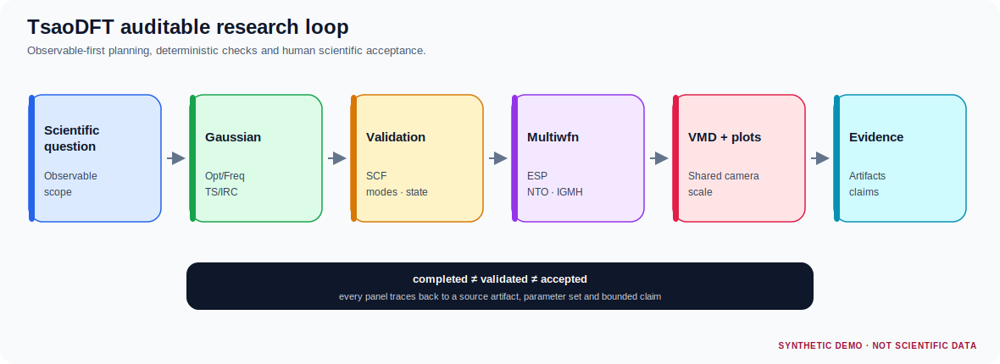
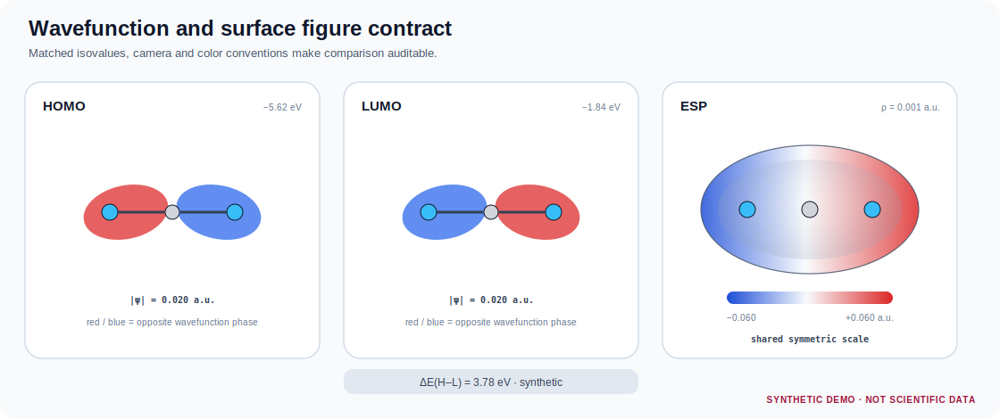
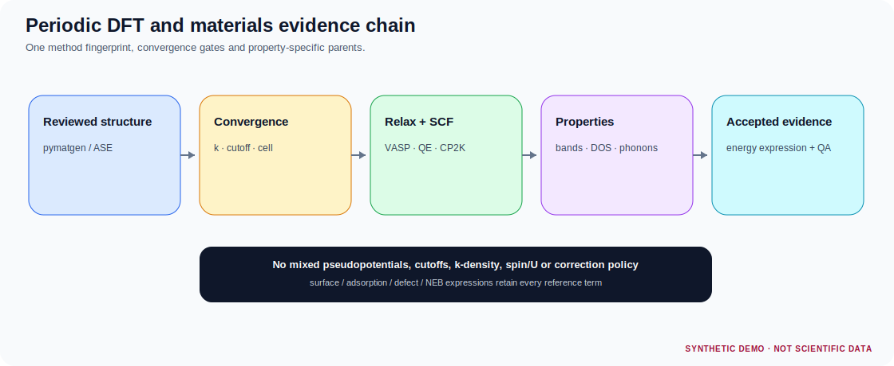
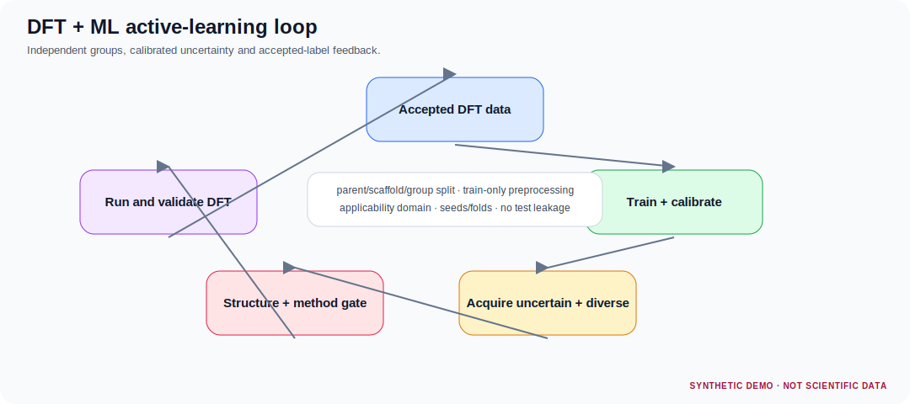
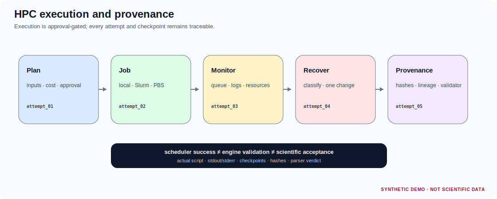
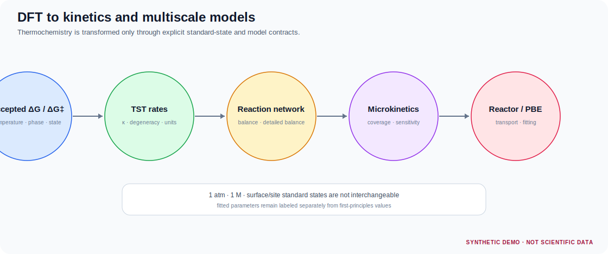

# TsaoDFT Skill

<p align="center"><strong>结构审查 → 分子/周期 DFT → 技术验收 → 波函数与材料性质 → HPC溯源 → ML/动力学 → 证据与图件</strong></p>

<p align="center"><a href="README.md">中文</a> · <a href="README_EN.md">English</a></p>

`TsaoDFT_skill` 是一套以 **DFT证据链** 为中心的 Agent Skills 仓库。它不把“支持某个软件”写成空泛口号，而是区分方法参考、结构化交接、确定性适配器和真实引擎回归四个等级。

```text
scientific question
→ reviewed structure campaign
→ molecular/periodic method fingerprint
→ preflight + approval
→ DFT engine execution
→ technical validation
→ quantitative analysis
→ accepted artifact
→ optional ML / kinetics
→ calculation–artifact–claim audit
```



> README中的图由仓库脚本基于模拟数据确定性生成，图内均标注 `SYNTHETIC DEMO · NOT SCIENTIFIC DATA`。它们展示图件风格，不是Gaussian、VASP、QE、CP2K或Multiwfn真实结果。

## 8个DFT相关Skills

| Skill | 适用工作 | 深度与边界 |
|---|---|---|
| [`tsao-dft-suite`](skills/tsao-dft-suite/) | 仓库总入口；建立DFT任务DAG、方法指纹、跨Skill交接、成本和审批门 | 只负责DFT优先编排，不替代引擎Skill |
| [`tsao-structure-prep`](skills/tsao-structure-prep/) | 分子、配合物、晶体、表面、缺陷、吸附与候选结构矩阵 | XYZ检查和原子映射已实现；不静默决定电荷、自旋、终止面或氧化态 |
| [`tsao-dft-researcher`](skills/tsao-dft-researcher/) | Gaussian分子DFT/TDDFT、Opt/Freq、TS/IRC、热化学、NMR、Multiwfn、VMD及证据审计 | 当前最深的分子DFT适配器；真实软件仍由用户提供 |
| [`tsao-periodic-dft-materials`](skills/tsao-periodic-dft-materials/) | VASP、Quantum ESPRESSO、CP2K周期DFT、表面/缺陷、能带/DOS、NEB、声子和收敛 | 已加入三引擎输入预检与输出解析；不分发POTCAR/赝势 |
| [`tsao-dft-hpc-provenance`](skills/tsao-dft-hpc-provenance/) | 本地/Slurm/PBS脚本、批量任务、资源估算、站点Profile、检查点和重启谱系 | 负责执行机制，不决定泛函、基组、U值或模型 |
| [`tsao-dft-ml-active-learning`](skills/tsao-dft-ml-active-learning/) | DFT标签数据、DeepChem/RDKit交接、基线模型、适用域、主动学习和逆向设计 | 已实现泄漏审计和NumPy ridge基线；SHAP不是因果证据 |
| [`tsao-dft-kinetics-multiscale`](skills/tsao-dft-kinetics-multiscale/) | Eyring/TST、反应网络、详细平衡、速率不确定度及Cantera/CatMAP/Pyomo交接 | 只消费已接受DFT热化学；反应器结果不是DFT的自动延伸 |
| [`tsao-dft-catalysis-profile`](skills/tsao-dft-catalysis-profile/) | DCS/MCSOMe/DMOS、Si–O/Si–C、Ti/TEA、Ziegler–Natta和聚烯烃催化问题 | 专用Profile；不得用于无关体系或把孤立分子DFT写成工业中毒结论 |

## 支持等级

| 等级 | 含义 |
|---|---|
| `L0_REFERENCE` | 只有方法与边界说明 |
| `L1_HANDOFF` | 能输出结构化Manifest或交接文件 |
| `L2_VALIDATED_ADAPTER` | 有确定性预检/解析/验证脚本和测试 |
| `L3_EXECUTION_TESTED` | L2基础上，已在真实引擎、版本和站点完成回归 |

本版本的Gaussian、VASP、QE和CP2K属于**选定字段的L2适配器**，不是完整解析器，也没有在当前交付环境声称L3。详细状态见 [`docs/ENGINE_SUPPORT_MATRIX.md`](docs/ENGINE_SUPPORT_MATRIX.md) 和 [`docs/CAPABILITY_STATUS.yaml`](docs/CAPABILITY_STATUS.yaml)。

## 分子DFT：Gaussian → Multiwfn → VMD

核心能力包括：

- Gaussian输入预检；
- route、方法/基组、溶剂、色散、积分网格和作业类型提取；
- SCF、优化、频率、热化学、S²、稳定性、轨道能、偶极矩、NMR、TD跃迁组分和最终坐标解析；
- TS虚频、正反向IRC和端点证据门；
- Multiwfn语义配方、版本、输入哈希、等值面、片段和输出检查；
- VMD/Tachyon脚本、固定相机、统一MO等值面和对称ESP色标；
- DFT不确定度与敏感性预算。



```bash
python skills/tsao-dft-researcher/scripts/preflight_gaussian_input.py job.gjf --json
python skills/tsao-dft-researcher/scripts/parse_gaussian.py job.log --json --out parsed.json
python skills/tsao-dft-researcher/scripts/validate_multiwfn_recipe.py recipe.yaml
python skills/tsao-dft-researcher/scripts/validate_uncertainty_budget.py uncertainty.yaml
```

## 周期DFT：VASP / QE / CP2K

周期Skill目前能确定性检查：

- **VASP**：INCAR、POSCAR、KPOINTS、POTCAR `TITEL`顺序，OUTCAR总能、电子/离子收敛、力、费米能和计时；
- **Quantum ESPRESSO**：`pw.x` namelist、结构卡、赝势文件名、cutoff、k点、自旋，总能、SCF、力、压力和费米能；
- **CP2K**：RUN_TYPE、MOLOPT/GTH文件、CUTOFF/REL_CUTOFF、KIND、PBC/Poisson和SCF，总能与几何收敛；
- cutoff、k点、超胞、真空或其他单参数收敛表分析；
- 吸附、缺陷、表面和NEB的任务专用Manifest门。



```bash
python skills/tsao-periodic-dft-materials/scripts/preflight_vasp.py ./vasp-run
python skills/tsao-periodic-dft-materials/scripts/parse_vasp.py ./vasp-run/OUTCAR
python skills/tsao-periodic-dft-materials/scripts/preflight_qe.py si.in
python skills/tsao-periodic-dft-materials/scripts/parse_qe.py si.out
python skills/tsao-periodic-dft-materials/scripts/preflight_cp2k.py si.inp
python skills/tsao-periodic-dft-materials/scripts/parse_cp2k.py si.out
```

## DFT＋ML闭环

模型训练前必须先固定独立样本单位。构象、电荷态、自旋态、重复计算或随机种子不自动成为独立样本。

已实现：

- DFT标签方法指纹和保真度审计；
- parent/group跨split泄漏检查；
- train-only预处理的分组ridge基线；
- predictions和model card；
- active-learning候选去重与批次选择；
- 适用域和不确定度缺失警告。



## HPC与计算溯源

HPC Skill记录引擎版本、模块、队列、MPI/OpenMP/GPU布局、资源上界、scratch、实际脚本、输入输出哈希和重启谱系。调度成功只说明进程结束。



```bash
python skills/tsao-dft-hpc-provenance/scripts/validate_site_profile.py site-profile.yaml
python skills/tsao-dft-hpc-provenance/scripts/validate_hpc_manifest.py job.yaml
python skills/tsao-dft-hpc-provenance/scripts/estimate_resources.py job.yaml --jobs 20
python skills/tsao-dft-hpc-provenance/scripts/generate_job_script.py job.yaml --out job.sh
```

## DFT到速率与多尺度

只有在温度、相态、标准态、反应物参考、路径简并度、隧穿和分子数约定清楚时，DFT势垒才能转成速率。



已实现元素/电荷/位点守恒、正反势垒闭合、Eyring速率、势垒不确定度传播和审查型Cantera交接。导出的Cantera文件明确标注为**非自动可运行机制**，直到完整热力学和速率模型通过下游验证。

## 安装

```bash
python scripts/install.py --list
python scripts/install.py --agent codex --scope user --skill all --dry-run --validate
python scripts/install.py --agent codex --scope user --skill all
```

只安装DFT核心：

```bash
python scripts/install.py --agent codex --scope user \
  --skill tsao-dft-suite \
  --skill tsao-structure-prep \
  --skill tsao-dft-researcher \
  --skill tsao-periodic-dft-materials \
  --skill tsao-dft-hpc-provenance
```

## 调用示例

```text
使用 $tsao-dft-suite。
目标：比较分子配合物与周期表面上三条反应路径。
先建立结构候选、分子/周期方法指纹、收敛计划、跨Skill handoff、资源估算和科学接受条件；不提交计算。
```

```text
使用 $tsao-periodic-dft-materials 审计这个VASP目录。
先检查POSCAR/POTCAR顺序、INCAR和k点，解析OUTCAR，再判断它只到program-completed、technically-validated还是可以进入能量表达式。
```

## 验证

```bash
python -m pip install -r requirements.txt
python scripts/generate_readme_demos.py
python scripts/validate_catalog.py
python scripts/validate_repo.py --strict
python scripts/run_all_tests.py
```

仓库规则：**只在 `main` 工作，不创建功能、修复或发布分支。**项目运行状态写入 `.research/`，发布版本使用tag和Release，不依赖额外branch。

## 事实与许可证边界

本仓库不包含Gaussian、VASP、POTCAR、QE赝势、CP2K基组/势文件、Multiwfn、VMD/Tachyon、DeepChem、Cantera或调度器。当前环境完成的是脚本、Manifest、合成fixture和图件的确定性测试，没有声称完成真实授权生产计算。科学接受始终需要研究者审核。
