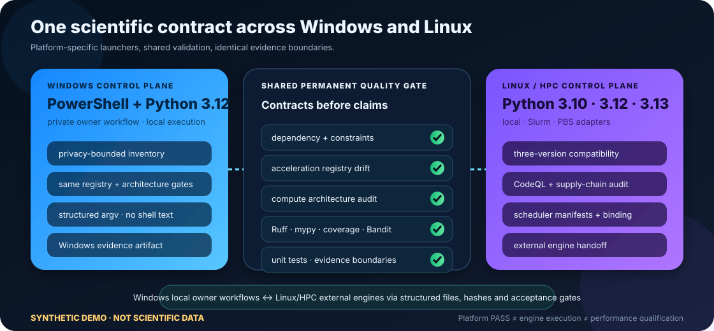

# TsaoDFT Skill

<p align="center">
  <strong>面向分子与周期体系的 DFT-first、证据锁定、可审计科研操作系统</strong><br>
  Python 科学控制面 + 可验证数值内核 + 外部专业引擎 + 不可伪造的资格边界
</p>

<p align="center">
  <a href="README.md">中文</a> · <a href="README_EN.md">English</a>
</p>

<p align="center">
  <a href="https://github.com/SUNHAOJUN22/TsaoDFT_skill/actions/workflows/ci.yml"></a>
  
  
  
  
  
  
</p>

> **AI图像声明｜AI-GENERATED CONCEPTUAL ILLUSTRATION：** 下方唯一 AI 封面只表达研究场景和系统概念。分子、晶格、轨道、服务器与界面均不是 Gaussian、VASP、Quantum ESPRESSO、CP2K、Multiwfn、VMD 或实验产生的数据。其余架构图是仓库脚本治理的确定性 SVG，并明确标注为合成示意；定量结论必须来自通过验收的源文件、计算产物和机器证据。

<p align="center">
  
</p>

## 最高工程原则

本仓库遵循 [`docs/ACCELERATION_ENGINEERING_DOCTRINE.md`](docs/ACCELERATION_ENGINEERING_DOCTRINE.md)：

1. **Python 是科学控制面，不是需要整体替换的缺陷。** 它负责工作流、Schema、方法指纹、调度、解析、证据和报告。
2. **不重写专业 DFT 内核。** FFT、对角化、积分、SCF、MPI/OpenMP/GPU 内核由 VASP、QE、CP2K、Gaussian 等专业程序承担。
3. **只迁移被代表性 profiling 证明的窄热点。** 顺序是 CPU reference → NumPy/算法优化 → 可选 C++/OpenMP → 可选 CUDA/HIP/SYCL。
4. **任何新后端必须保留确定性参考、失败回退和数值等价门。** 启动、进程、数据搬运和 kernel 开销必须计入端到端成本。
5. **技术感知不等于真实执行。** 注册表中理解 CUDA-X、ROCm、oneAPI、Metal，不代表库、硬件或兼容引擎构建已经使用。
6. **没有真实求解器、许可证、固定输入、稳定硬件身份、科学容差和重复运行，就不发布加速比。** 外部资格保持 `EXTERNAL_HOLD`。

## 30 秒看懂 TsaoDFT

<table>
<tr>
<td width="25%" valign="top"><strong>DFT-first</strong><br><sub>先定义结构、方法指纹、参考态与验收条件，再进入执行。</sub></td>
<td width="25%" valign="top"><strong>Evidence graph</strong><br><sub>计算、产物、图件与主张之间建立显式支持边，失败尝试也保留。</sub></td>
<td width="25%" valign="top"><strong>Multi-engine</strong><br><sub>分子侧覆盖 Gaussian；周期侧覆盖 VASP、QE、CP2K，并保持许可证与进程边界。</sub></td>
<td width="25%" valign="top"><strong>Profile-gated acceleration</strong><br><sub>CPU/GPU、原生层、ML 和 HPC 只有在等价与证据门之后才可升级。</sub></td>
</tr>
</table>

```text
planned
→ prepared
→ completed
→ technically validated
→ scientifically accepted
→ claim accepted
```

<p align="center">
  
</p>

## 八个 Skills，一条证据链

| Skill | 核心职责 | 不可越过的边界 |
|---|---|---|
| [`tsao-dft-suite`](skills/tsao-dft-suite/) | DFT-first 总入口、DAG、跨 Skill 路由、成本与审批门 | 协调，不替代引擎级科学判断 |
| [`tsao-structure-prep`](skills/tsao-structure-prep/) | 分子、晶体、表面、缺陷、吸附、原子映射、邻居搜索 | 不静默决定电荷、自旋、氧化态、终止面或质子化 |
| [`tsao-dft-researcher`](skills/tsao-dft-researcher/) | Gaussian DFT/TDDFT、Opt/Freq、TS/IRC、热化学、NMR、Multiwfn、VMD | 真实程序、许可证和执行环境由用户提供 |
| [`tsao-periodic-dft-materials`](skills/tsao-periodic-dft-materials/) | VASP、Quantum ESPRESSO、CP2K、表面/缺陷、能带/DOS、NEB 与收敛 | 不分发受限数据，不混用不兼容能量 |
| [`tsao-dft-ml-active-learning`](skills/tsao-dft-ml-active-learning/) | DFT 标签审计、泄漏防护、适用域、不确定度、主动学习 | 高分数不是机理或因果证据 |
| [`tsao-dft-kinetics-multiscale`](skills/tsao-dft-kinetics-multiscale/) | Eyring/TST、反应网络、详细平衡、误差传播与反应器交接 | 只消费标准态和热化学校验通过的数据 |
| [`tsao-dft-hpc-provenance`](skills/tsao-dft-hpc-provenance/) | Windows/POSIX、Slurm/PBS、硬件盘点、Parser、基准、签名与内容寻址证据 | GPU 分配、最快单次或合成 fixture 不等于真实加速 |
| [`tsao-dft-catalysis-profile`](skills/tsao-dft-catalysis-profile/) | 催化与聚合物专用 Profile | 不自动外推到无关体系 |

## 已实现的软件加速层

### 1. 结构邻居搜索

`skills/tsao-structure-prep/scripts/neighbor_list.py` 是仓库首个受治理的自有数值核心：

- `reference`：标量全对参考；
- `numpy`：有界内存的逐行向量化；
- `cell-list`：只枚举占用网格的相邻候选；
- `auto`：中型结构选择 NumPy，大型结构选择 cell-list；
- 支持非周期、正交周期、三斜周期和部分周期轴；
- 所有后端共享 minimum-image 定义和确定性 pair 排序；
- 坐标、cutoff、周期标志和盒矩阵严格 fail-closed；
- 不隐式选择 GPU。

```bash
python skills/tsao-structure-prep/scripts/inspect_xyz.py structure.xyz \
  --backend cell-list \
  --json

python skills/tsao-structure-prep/scripts/inspect_xyz.py periodic.xyz \
  --backend cell-list \
  --periodic xyz \
  --box 10 0 0 0 10 0 0 0 10 \
  --json
```

报告中的 `pair_count` 与 `evaluated_pair_count` 只证明候选枚举变化，不构成 DFT 引擎性能证据。

### 2. 共享 mmap Parser

`skills/tsao-dft-hpc-provenance/scripts/engine_scan_core.py` 提供：

- 只读 mmap；
- 映射工件 SHA-256；
- 有界 literal/regex 扫描；
- last-marker 和 block 边界；
- 确定性资源释放。

`engine_parser_contract.py` 的 Gaussian、VASP、QE、CP2K 路径全部消费该核心，并保留 fatal-over-success、最终 Link1、非有限数值拒绝和旧公共入口兼容。Parser I/O 优化不等于电子结构计算加速。

## 当前与未来计算分层

| 层 | 状态 | 技术 | 证据要求 |
|---|---|---|---|
| 科学控制面 | 已实现 | Python、JSON Schema、YAML、结构化 argv | 永久 Linux/Windows 门 |
| CPU 数值参考 | 已实现 | 标量、NumPy、BLAS/LAPACK | 确定性、有限数值、回归等价 |
| cell-list 邻居核 | 已实现 | NumPy + 网格候选缩减 | reference/NumPy/cell-list 等价 |
| mmap Parser 传输 | 已实现 | mmap、bytes regex、SHA-256 | 四引擎状态机回归 |
| C++/OpenMP sidecar | 未建立 | C++20、窄 JSON/file 协议 | profiling、Windows/Linux build、sanitizer、fallback |
| CUDA/HIP/SYCL | 未建立 | 可选设备插件 | 明确 device、CPU/GPU 等价、端到端基准 |
| 外部引擎加速 | `EXTERNAL_HOLD` | 引擎官方 GPU/MPI 构建 | 许可证、build/site/run/hardware、≥3 repeats、verified artifacts |

<p align="center">
  
</p>

## 加速注册表与技术解释

权威注册表：

```text
skills/tsao-dft-hpc-provenance/scripts/acceleration_registry.py
```

它统一管理后端、供应商、别名、可用工作负载和禁止解释。永久门拒绝规划器重新维护镜像目录。

| 路线 | 合法用途 | 禁止解释 |
|---|---|---|
| cuBLAS / cuSOLVER | 大型重复密集线代，数据已驻留设备 | “Python 自动变快” |
| cuSPARSE | 经 profiling 证明的稀疏问题 | 小型密集表格通用优化 |
| cuFFT / cuFFTMp | 引擎官方集成或自有 FFT 内核 | wrapper 自动加速 VASP/QE/CP2K |
| cuTENSOR | 自有高阶张量 contraction | 外部 DFT 通用开关 |
| cuEquivariance | 已验收的 MACE/NequIP/e3nn 类模型 | Kohn–Sham DFT 加速器 |
| NCCL / NVSHMEM | 兼容构建的多 GPU/分布式通信 | Parser、小文件或单 GPU 通用优化 |
| ROCm / oneAPI / Metal | 对应供应商与工作负载的显式路线 | 自动移植另一供应商构建 |

<table>
<tr>
<td width="50%"></td>
<td width="50%"></td>
</tr>
<tr>
<td></td>
<td></td>
</tr>
</table>

## 外部专业引擎边界

- **VASP：** 只认可对应版本的官方 GPU/OpenACC 构建、CUDA-aware MPI、GPU/rank 绑定和完整 build fingerprint。
- **Quantum ESPRESSO：** 记录版本、编译器、GPU 支持、MPI、pool/task-group 与对角化路径。
- **CP2K：** 记录官方 CUDA/HIP/OpenCL 构建能力和真实运行身份。
- **Gaussian：** 仓库负责预检、Parser、批处理与证据；除非安装产品明确支持，否则不得声称加速电子结构核心。

不同引擎、build、site 或硬件身份不能合并成一个 speedup campaign。

<p align="center">
  
</p>

## 证据合同与资格链

核心机器合同：

- benchmark-result canonical nested v1.1；
- compute-campaign canonical v1.1；
- legacy v1.0 只能通过中央迁移；
- custom Schema 不具资格；
- `CampaignConfig` 与 `CampaignDocument` 递归冻结；
- role、run、site、build、hardware、多 GPU、scientific identity、artifact 全部显式核验；
- unknown/mixed、额外字段、重复键、类型混淆、NaN/Infinity 全部 fail-closed；
- 迁移不补默认值、不生成 evidence、不提升资格。

```bash
python scripts/validate_benchmark_contract.py --json
python scripts/validate_compute_qualification.py --json
python scripts/capture_compute_contract_evidence.py --json
```

机器证据 Schema v1.5 同时记录：

```text
python_control_plane: true
whole_repo_cpp_rewrite: NOT_RECOMMENDED
neighbor_search.implemented: true
parser_scan.implemented: true
native_sidecar.implemented: false
cuda_kernels.implemented: false
external_engine_acceleration: EXTERNAL_HOLD
external_engine_invoked: false
performance_ratio_published: false
```

<p align="center">
  
</p>

<p align="center">
  
</p>

## ML、动力学与边缘计算

边缘路线不是“在边缘设备运行完整生产 DFT”，而是：

```text
结构与条件
→ 已验收 surrogate
→ uncertainty / OOD gate
→ 安全域内推理
→ 域外远程真实 DFT
→ 结果回流受治理数据集
```

必须保存模型版本、训练数据哈希、特征定义、校准、OOD 阈值和 fallback；surrogate 与真实 DFT 是不同证据等级。

<table>
<tr>
<td width="50%"></td>
<td width="50%"></td>
</tr>
<tr>
<td></td>
<td></td>
</tr>
</table>

## 科研图件治理

下列图件均为 `SYNTHETIC DEMO · NOT SCIENTIFIC DATA`，用于展示图件合同和证据组织，不是生产结果。

<table>
<tr>
<td width="50%"></td>
<td width="50%"></td>
</tr>
</table>

视觉体系见 [`docs/README_VISUAL_DESIGN_SYSTEM.md`](docs/README_VISUAL_DESIGN_SYSTEM.md)，AI 图治理见 [`docs/AI_IMAGE_GOVERNANCE.md`](docs/AI_IMAGE_GOVERNANCE.md)。

## 安装与快速验证

```bash
python scripts/install.py \
  --agent codex \
  --scope project \
  --skill all \
  --dry-run \
  --validate

python scripts/quality_gate.py
```

PowerShell：

```powershell
pwsh -NoProfile -File .\scripts\quality_gate.ps1
```

更多合同：

- [`docs/ENGINE_SUPPORT_MATRIX.md`](docs/ENGINE_SUPPORT_MATRIX.md)
- [`docs/DFT_VALIDATION_LADDER.md`](docs/DFT_VALIDATION_LADDER.md)
- [`docs/CROSS_SKILL_HANDOFF.md`](docs/CROSS_SKILL_HANDOFF.md)
- [`docs/CAPABILITY_STATUS.yaml`](docs/CAPABILITY_STATUS.yaml)

## 永久资格门

每个 `main` HEAD 必须通过：

```text
Python 3.10
Python 3.12
Python 3.13
Windows PowerShell
Dependency audit + CycloneDX SBOM
CodeQL
28/28 repository quality stages
629 tests / 9 suites
```

当前正式证据：

| 平台 | Statement | Branch | 结果 |
|---|---:|---:|---|
| Linux Python 3.12 | 93.87% | 83.86% | PASS |
| Windows Python 3.12 | 93.81% | 83.70% | PASS |
| `engine_parser_contract.py` | 100.00% | 100.00% | core gate PASS |
| `neighbor_list.py` | 98.29% | 95.10% | equivalence gate PASS |

这些数字证明软件工件通过测试，不证明外部 DFT 引擎加速。外部执行与速度资格继续保持 `EXTERNAL_HOLD`。

---

**TsaoDFT 的目标不是让每一个文件看起来更“底层”，而是让每一次科学结论、性能结论和工程迁移都有可复核的证据边界。**
