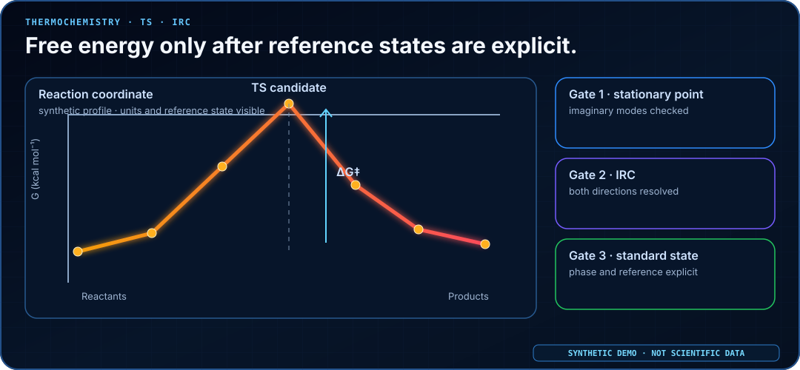

# TsaoDFT Skill

<p align="center">
<strong>DFT-first computational chemistry research workflow</strong><br>
Structure → DFT calculation → validation → wavefunction/material analysis → evidence → publication-ready outputs
</p>

<p align="center">
<a href="https://github.com/SUNHAOJUN22/TsaoDFT_skill/actions/workflows/ci.yml"></a>


</p>

<p align="center">

</p>

> The AI images in this README are conceptual illustrations only. They are not molecular structures, orbital plots, ESP maps, band structures, free-energy profiles, or experimental results. Quantitative scientific figures must come from validated calculations and source data.

## What is TsaoDFT?

`TsaoDFT_skill` is an auditable Agent Skills framework for computational chemistry. It focuses on keeping the complete chain traceable:

```text
scientific question
        ↓
model and method definition
        ↓
DFT calculation
        ↓
technical validation
        ↓
property analysis
        ↓
artifact and claim audit
```

## Core capabilities

| Area | Main functions |
|---|---|
| Molecular DFT | Gaussian Opt/Freq, TS/IRC, TDDFT, NMR, NBO, orbital analysis, thermochemistry |
| Wavefunction analysis | Multiwfn workflows, ESP, Fukui, IRI/IGMH, QTAIM, VMD rendering rules |
| Periodic DFT | VASP, Quantum ESPRESSO, CP2K workflow validation, surfaces, defects, adsorption, NEB |
| DFT + ML | Dataset auditing, leakage prevention, uncertainty, active learning |
| Kinetics | Eyring/TST, reaction networks, microkinetic handoff |
| HPC | Slurm/PBS/local execution provenance and restart tracking |

## Skills

- `tsao-dft-suite` — DFT project routing and cross-skill coordination
- `tsao-structure-prep` — molecular/crystal/surface model preparation
- `tsao-dft-researcher` — Gaussian-based molecular DFT research
- `tsao-periodic-dft-materials` — periodic DFT workflows
- `tsao-dft-hpc-provenance` — computation lifecycle tracking
- `tsao-dft-ml-active-learning` — DFT data and ML workflows
- `tsao-dft-kinetics-multiscale` — DFT-to-kinetics connection
- `tsao-dft-catalysis-profile` — optional catalysis-specific profile

## Scientific visualization

AI conceptual images describe workflow scenarios. Deterministic demonstrations are generated from scripts and synthetic source data.




## Validation philosophy

TsaoDFT separates:

```text
files exist
   ≠
program completed
   ≠
technically validated
   ≠
scientifically accepted
```

A Gaussian normal termination, a beautiful surface image, or a high ML score alone is not scientific proof.

## Installation

```bash
python scripts/install.py --agent codex --scope user --skill all
```

## Quality check

```bash
python scripts/validate_repo.py --strict
python scripts/run_all_tests.py
```

## Scientific boundaries

The repository does not distribute Gaussian, VASP, Quantum ESPRESSO, CP2K, Multiwfn, or VMD. Real production calculations require the user's licensed software environment.

The goal is not to automate scientific judgment away, but to make DFT research more reproducible, auditable, and efficient.

See:

- `docs/ENGINE_SUPPORT_MATRIX.md`
- `docs/SCIENTIFIC_BOUNDARIES.md`
- `docs/ARCHITECTURE.md`
- `docs/TEST_REPORT.md`
