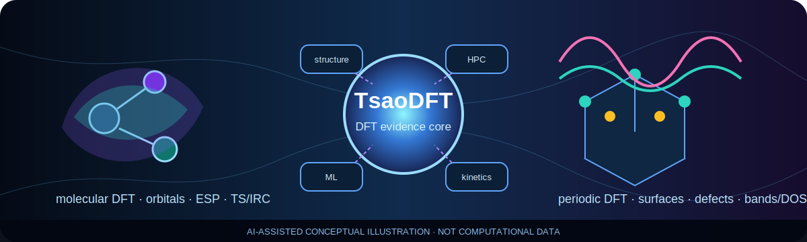

# TsaoDFT Skill 中文说明

本仓库的**规范中文 README 已统一维护在 [`README.md`](README.md)**，避免两个中文文件长期漂移。

> 上图和主 README 中的模块场景图属于 AI 生成或 AI 辅助概念图，只用于平台与研究场景表达，不是轨道、ESP、能带、自由能、机理或实验数据。

请直接阅读：

- [`README.md`](README.md)：完整中文说明、DFT能力、安装、验证和图像治理；
- [`README_EN.md`](README_EN.md)：English documentation；
- [`docs/AI_IMAGE_GOVERNANCE.md`](docs/AI_IMAGE_GOVERNANCE.md)：AI图像证据边界；
- [`docs/ENGINE_SUPPORT_MATRIX.md`](docs/ENGINE_SUPPORT_MATRIX.md)：引擎支持等级。
