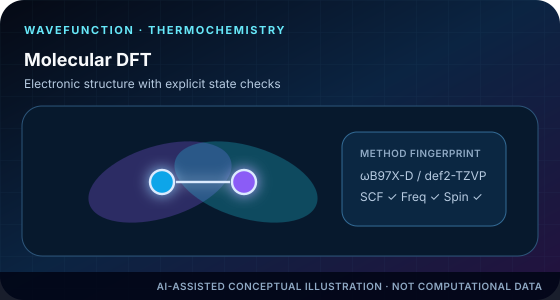
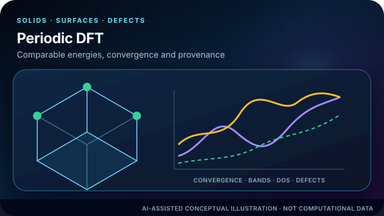
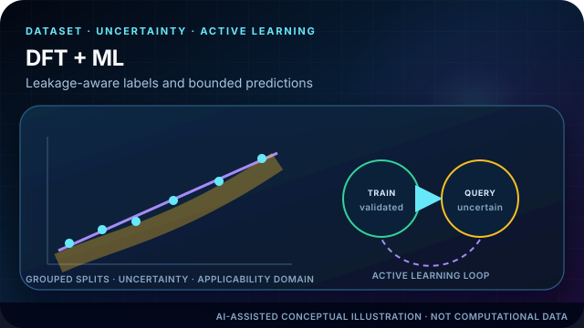
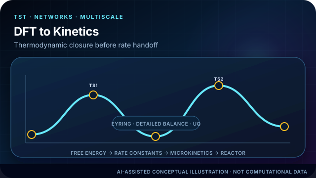
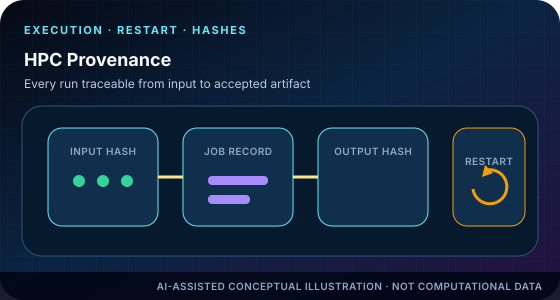
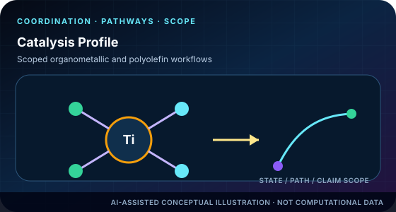
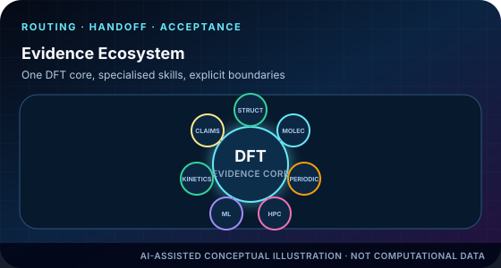
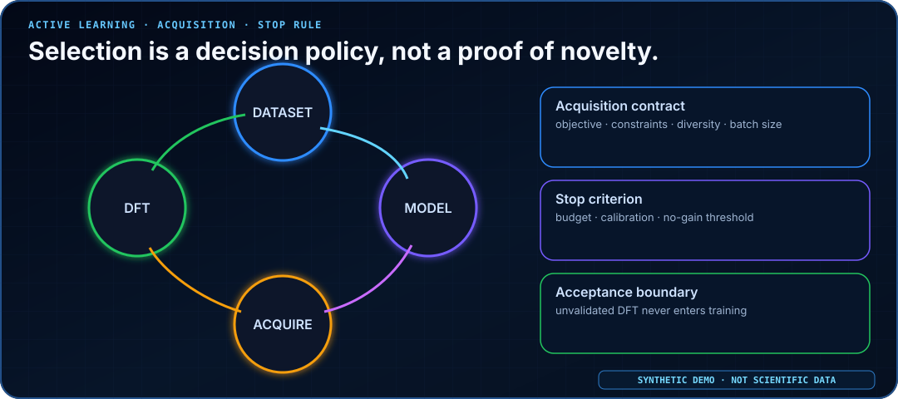
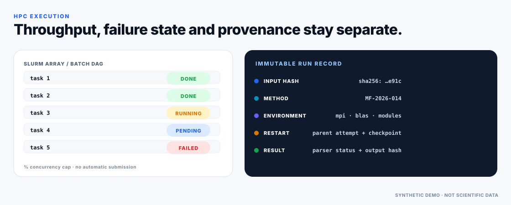

# TsaoDFT Skill

<p align="center">
  <strong>DFT-first, evidence-locked and auditable research workflows for molecular and periodic systems</strong><br>
  Structure review → method fingerprint → execution → technical validation → analysis → multiscale handoff → figure and claim audit
</p>

<p align="center">
  <a href="README.md">中文</a> · <a href="README_EN.md">English</a>
</p>

<p align="center">
  <a href="https://github.com/SUNHAOJUN22/TsaoDFT_skill/actions/workflows/ci.yml"></a>
  
  
  
</p>

> **AI image declaration | AI-GENERATED CONCEPTUAL ILLUSTRATION:** the hero and module cards are AI-generated or AI-assisted concepts used only to communicate research scenarios and product identity. They are not molecular structures, orbitals, electrostatic potentials, band structures, free-energy profiles, mechanisms, or experimental results. Quantitative claims require accepted source data, validated calculations and reproducible scripts.

<p align="center">
  
</p>

## What TsaoDFT is

`TsaoDFT_skill` is an Agent Skills repository organised around the **DFT evidence chain**. A normal termination, an attractive surface plot, or a high model score is not silently promoted into a scientific conclusion. Work moves through explicit states:

```text
planned → prepared → completed → technically validated → scientifically accepted → claim accepted
```

The governing rule is simple: **calculations, artifacts and publication claims must remain traceable, while unresolved assumptions stay visible.**

<p align="center">
  
</p>

## Eight composable Skills

| Skill | Purpose | Boundary |
|---|---|---|
| [`tsao-dft-suite`](skills/tsao-dft-suite/) | DFT-first orchestration, task DAGs, support-level routing, cost and approval gates | Coordinates work; it does not replace engine-level judgement |
| [`tsao-structure-prep`](skills/tsao-structure-prep/) | Molecular, crystal, surface, defect and adsorption candidates plus atom mapping | Never silently chooses charge, spin, oxidation state or termination |
| [`tsao-dft-researcher`](skills/tsao-dft-researcher/) | Gaussian molecular DFT/TDDFT, Opt/Freq, TS/IRC, thermochemistry, NMR, Multiwfn and VMD | The deepest molecular adapter; real software remains external |
| [`tsao-periodic-dft-materials`](skills/tsao-periodic-dft-materials/) | VASP, Quantum ESPRESSO and CP2K, including surfaces, defects, bands/DOS, NEB and convergence | Does not distribute POTCAR, pseudopotentials or restricted databases |
| [`tsao-dft-hpc-provenance`](skills/tsao-dft-hpc-provenance/) | Local/Slurm/PBS execution, estimates, checkpoints, restart lineage and hashes | Scheduler success is not scientific acceptance |
| [`tsao-dft-ml-active-learning`](skills/tsao-dft-ml-active-learning/) | DFT-label audit, leakage prevention, applicability domain, uncertainty and active learning | Correlation and SHAP do not prove causality or mechanism |
| [`tsao-dft-kinetics-multiscale`](skills/tsao-dft-kinetics-multiscale/) | Eyring/TST, networks, detailed balance, uncertainty and microkinetic handoff | Consumes only accepted thermochemistry with explicit standard states |
| [`tsao-dft-catalysis-profile`](skills/tsao-dft-catalysis-profile/) | DCS/MCSOMe/DMOS, Si–O/Si–C, Ti/TEA, Ziegler–Natta and polyolefin catalysis | A scoped profile, never auto-applied to unrelated chemistry |

## Concept gallery

Every concept is registered in [`assets/ai/manifest.yaml`](assets/ai/manifest.yaml) with dimensions, SHA-256, generation provenance, allowed uses and forbidden uses. These images explain module identity; they carry no quantitative evidence.

<table>
<tr>
<td width="50%" align="center"><br><strong>Molecular DFT and wavefunction evidence</strong></td>
<td width="50%" align="center"><br><strong>Periodic DFT, surfaces and defects</strong></td>
</tr>
<tr>
<td align="center"><br><strong>DFT labels, ML and active learning</strong></td>
<td align="center"><br><strong>DFT to kinetics and multiscale models</strong></td>
</tr>
<tr>
<td align="center"><br><strong>HPC execution, hashes and restart lineage</strong></td>
<td align="center"><br><strong>Catalysis and polyolefin profile</strong></td>
</tr>
<tr>
<td colspan="2" align="center"><br><strong>Unified DFT evidence ecosystem</strong></td>
</tr>
</table>

## Deterministic scientific demonstrations

These are versioned, deterministic synthetic SVG assets, each visibly labelled `SYNTHETIC DEMO · NOT SCIENTIFIC DATA`. The historical command name [`scripts/generate_readme_demos.py`](scripts/generate_readme_demos.py) is retained for compatibility, but the command is now a **strict read-only validator**: it checks XML, dimensions, titles, accessible descriptions, README references and non-data labels. Missing, degraded or placeholder assets fail the quality gate instead of being silently replaced with low-quality fallback artwork.

<table>
<tr>
<td width="50%"></td>
<td width="50%"></td>
</tr>
<tr>
<td></td>
<td></td>
</tr>
<tr>
<td></td>
<td></td>
</tr>
<tr>
<td colspan="2" align="center"></td>
</tr>
</table>

## Support levels

| Level | Meaning |
|---|---|
| `L0_REFERENCE` | Scientific documentation and boundaries only |
| `L1_HANDOFF` | Structured manifest or downstream handoff |
| `L2_VALIDATED_ADAPTER` | Deterministic preflight/parser/validator with repository tests |
| `L3_EXECUTION_TESTED` | L2 plus immutable regression evidence from the real engine, version and environment |

Gaussian, VASP, Quantum ESPRESSO and CP2K currently expose selected-field **L2 adapters**. TsaoDFT does not claim L3 without legal real-engine regression evidence.

## Installation

```bash
python scripts/install.py --list
python scripts/install.py --agent codex --scope user --skill all --dry-run --validate
python scripts/install.py --agent codex --scope user --skill all
```

## One-command quality gate

```bash
python -m pip install -r requirements.txt
python scripts/quality_gate.py
```

The quality gate runs, in order:

```text
validate versioned demo assets
→ catalog validation
→ AI asset integrity and provenance
→ README visual completeness
→ strict repository audit
→ all unittest suites
```

For focused diagnostics:

```bash
python scripts/generate_readme_demos.py
python scripts/validate_catalog.py
python scripts/validate_ai_assets.py
python scripts/validate_readme_visuals.py --strict
python scripts/validate_repo.py --strict
python scripts/run_all_tests.py
```

## Scientific boundaries

The repository does not distribute Gaussian, VASP, Quantum ESPRESSO, CP2K, Multiwfn, VMD, POTCAR, pseudopotentials, or restricted basis/potential libraries, and it does not bypass licensing. Production calculations require a legally configured user environment.

Read next:

- [`docs/ARCHITECTURE.md`](docs/ARCHITECTURE.md)
- [`docs/ENGINE_SUPPORT_MATRIX.md`](docs/ENGINE_SUPPORT_MATRIX.md)
- [`docs/CAPABILITY_STATUS.yaml`](docs/CAPABILITY_STATUS.yaml)
- [`docs/SCIENTIFIC_BOUNDARIES.md`](docs/SCIENTIFIC_BOUNDARIES.md)
- [`docs/AI_IMAGE_GOVERNANCE.md`](docs/AI_IMAGE_GOVERNANCE.md)
- [`docs/TEST_REPORT.md`](docs/TEST_REPORT.md)

Repository policy: work directly on `main`; use Tags/Releases for publication snapshots rather than feature, fix or temporary branches.
