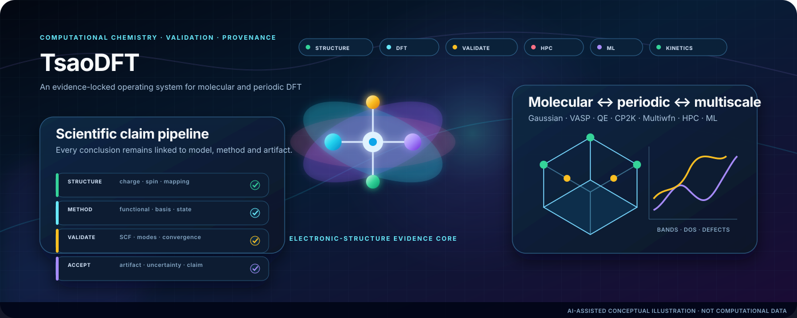
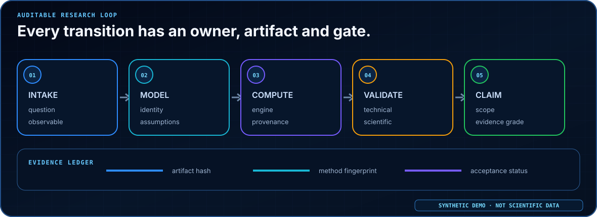
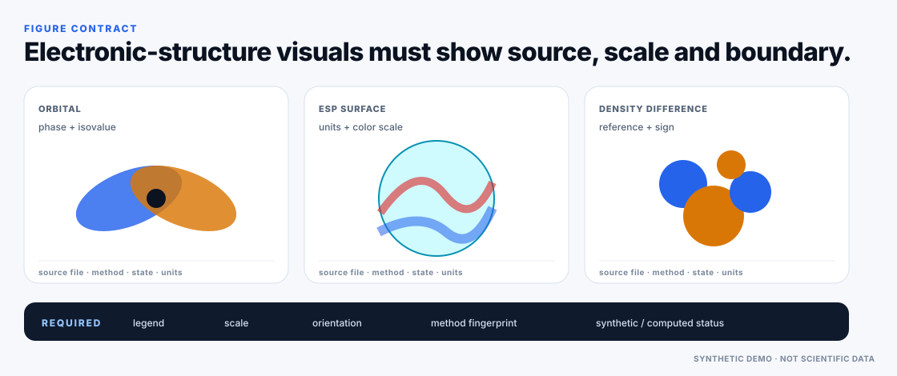
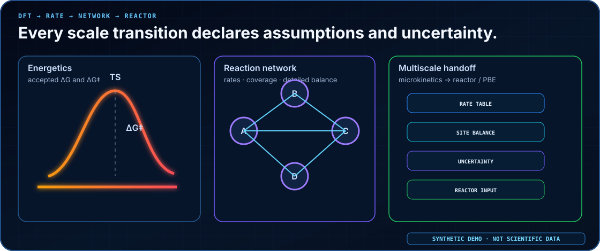

# TsaoDFT Skill

<p align="center">
  <strong>A DFT-first, evidence-locked and auditable research operating system for molecular and periodic science</strong><br>
  From structure preparation and real-engine execution to wavefunctions, materials properties, machine learning, kinetics, HPC provenance and publication-claim audit
</p>

<p align="center">
  <a href="README.md">中文</a> · <a href="README_EN.md">English</a>
</p>

<p align="center">
  <a href="https://github.com/SUNHAOJUN22/TsaoDFT_skill/actions/workflows/ci.yml"></a>
  
  
  
  
</p>

> **AI image declaration | AI-GENERATED CONCEPTUAL ILLUSTRATION:** the overview below was generated with the UI/UX Pro Max Hero-Centric + Evidence Bento workflow. Its molecules, lattice, orbital-like forms, servers and data interfaces communicate research context only; they are not outputs from Gaussian, VASP, Quantum ESPRESSO, CP2K, Multiwfn, VMD or experiment. Quantitative claims still require accepted source files, calculation artifacts and reproducible scripts.

<p align="center">
  
</p>

## TsaoDFT in 30 seconds

<table>
<tr>
<td width="25%" valign="top"><strong>DFT-first</strong><br><sub>A question is grounded in structure, method fingerprint, reference state and acceptance criteria before execution.</sub></td>
<td width="25%" valign="top"><strong>Evidence graph</strong><br><sub>Calculations, artifacts, figures and manuscript claims receive explicit support edges; failed attempts remain visible.</sub></td>
<td width="25%" valign="top"><strong>Multi-engine</strong><br><sub>Molecular work covers Gaussian / Multiwfn / VMD; periodic work covers VASP / QE / CP2K.</sub></td>
<td width="25%" valign="top"><strong>Scale with provenance</strong><br><sub>DFT labels, ML, kinetics and HPC may consume accepted evidence but never bypass scientific boundaries.</sub></td>
</tr>
</table>

`TsaoDFT_skill` is not a loose prompt collection. It never promotes normal termination, an attractive plot or a high model score directly into a scientific conclusion. Work moves through an explicit state chain:

```text
planned
→ prepared
→ completed
→ technically validated
→ scientifically accepted
→ claim accepted
```

## From scientific question to defensible claim

<p align="center">
  
</p>

Every state transition must answer:

1. **Who owns acceptance?**
2. **Which artifact supports the decision?**
3. **Which method fingerprint, software version and execution environment were used?**
4. **Which assumptions, uncertainties and claim boundaries remain open?**

## Eight Skills, one evidence chain

| Skill | Best used for | Boundary that must not be crossed |
|---|---|---|
| [`tsao-dft-suite`](skills/tsao-dft-suite/) | DFT-first entry point, task DAG, cross-Skill routing, cost and approval gates | Coordinates work; does not replace engine-level scientific judgement |
| [`tsao-structure-prep`](skills/tsao-structure-prep/) | Molecules, conformers, crystals, surfaces, defects, adsorption candidates and atom mapping | Never silently chooses charge, spin, oxidation state, termination or protonation |
| [`tsao-dft-researcher`](skills/tsao-dft-researcher/) | Gaussian molecular DFT/TDDFT, Opt/Freq, TS/IRC, thermochemistry, NMR, Multiwfn and VMD | Real executables, licences and environments remain external; adapters never fabricate execution |
| [`tsao-periodic-dft-materials`](skills/tsao-periodic-dft-materials/) | VASP, Quantum ESPRESSO and CP2K, including surfaces/defects, bands/DOS, NEB and convergence | Does not distribute POTCAR, pseudopotentials or restricted databases; incompatible energies cannot be mixed |
| [`tsao-dft-ml-active-learning`](skills/tsao-dft-ml-active-learning/) | DFT-label audit, leakage prevention, applicability domain, uncertainty, active learning and inverse design | High R², SHAP or acquisition score does not prove mechanism, causality or synthesizability |
| [`tsao-dft-kinetics-multiscale`](skills/tsao-dft-kinetics-multiscale/) | Eyring/TST, reaction networks, detailed balance, uncertainty, microkinetics and reactor handoff | Consumes only data with explicit and accepted standard/reference states |
| [`tsao-dft-hpc-provenance`](skills/tsao-dft-hpc-provenance/) | Local/Slurm/PBS execution, estimates, arrays, checkpoints, restart lineage and hashes | Scheduler success only means that the process ended |
| [`tsao-dft-catalysis-profile`](skills/tsao-dft-catalysis-profile/) | DCS/MCSOMe/DMOS, Si–O/Si–C, Ti/TEA, Ziegler–Natta and polyolefin catalysis | Scoped profile; never auto-applied to unrelated catalysis |

## Scientific figures: conceptual identity and deterministic evidence stay separate

The four figures below are generated from fixed synthetic data and repository scripts. Every asset is labelled `SYNTHETIC DEMO · NOT SCIENTIFIC DATA`. They demonstrate figure contracts, acceptance gates and evidence organisation—not production results.

<table>
<tr>
<td width="50%"></td>
<td width="50%"></td>
</tr>
<tr>
<td></td>
<td></td>
</tr>
</table>

The visual system follows UI/UX Pro Max product classification, Pattern, Style, Colors, Typography, Density, Anti-pattern and Accessibility stages. See [`docs/README_VISUAL_DESIGN_SYSTEM.md`](docs/README_VISUAL_DESIGN_SYSTEM.md). AI governance is recorded in [`docs/AI_IMAGE_GOVERNANCE.md`](docs/AI_IMAGE_GOVERNANCE.md).

## Support levels

| Level | Meaning | Reporting boundary |
|---|---|---|
| `L0_REFERENCE` | Method, boundary and reference material only | Method reference only |
| `L1_HANDOFF` | Structured manifest or downstream handoff | Requires downstream validation |
| `L2_VALIDATED_ADAPTER` | Deterministic preflight/parser/validator plus repository tests | May report adapter validation, not real-engine regression |
| `L3_EXECUTION_TESTED` | L2 plus immutable evidence from the real engine, version and site | May report real execution only within the documented scope |

Gaussian, VASP, Quantum ESPRESSO and CP2K currently expose selected-field **L2 adapters**. TsaoDFT does not claim L3 without legal real-engine regression evidence.

## Quick start

List installable Skills:

```bash
python scripts/install.py --list
```

Validate without writing:

```bash
python scripts/install.py \
  --agent codex \
  --scope user \
  --skill all \
  --dry-run \
  --validate
```

Install all Skills:

```bash
python scripts/install.py \
  --agent codex \
  --scope user \
  --skill all
```

Production execution still requires legally configured engines, licences, pseudopotentials or basis libraries, a site guide and user authorisation.

## Engineering quality and one-command acceptance

```bash
python -m pip install -r requirements-dev.txt
python -m pip check
python scripts/quality_gate.py
```

Current baseline: **100 unit tests, 9 isolated suites, 0 failed suites**. Every quality stage has an explicit timeout, and `--json` is safe for machine parsing. Gate order:

```text
versioned demo assets
→ dependency and version contract
→ DFT catalog
→ governed AI cover
→ bilingual README visuals
→ offline local links
→ Ruff lint
→ Ruff formatting
→ strict repository audit
→ all non-empty test suites
```

Engineering audit, performance implementation and boundaries:

- [`docs/CODE_QUALITY_AUDIT.md`](docs/CODE_QUALITY_AUDIT.md)
- [`docs/PERFORMANCE_AUDIT.md`](docs/PERFORMANCE_AUDIT.md)
- [`docs/PERFORMANCE_GUIDE.md`](docs/PERFORMANCE_GUIDE.md)
- [`docs/TEST_REPORT.md`](docs/TEST_REPORT.md)

## Scientific boundaries

This repository:

- does not distribute Gaussian, VASP, Quantum ESPRESSO, CP2K, Multiwfn, VMD, POTCAR, pseudopotentials or restricted basis/potential libraries;
- does not bypass licences, site policy or software access controls;
- never presents conceptual AI imagery as an orbital, ESP, band structure, free-energy profile, transition state, mechanism or experiment;
- never equates normal termination, scheduler completion, model score or attractive graphics with scientific acceptance;
- never claims `L3_EXECUTION_TESTED` without immutable real-engine evidence.

## Documentation map

| Document | Purpose |
|---|---|
| [`docs/ARCHITECTURE.md`](docs/ARCHITECTURE.md) | Architecture and state flow |
| [`docs/ENGINE_SUPPORT_MATRIX.md`](docs/ENGINE_SUPPORT_MATRIX.md) | Engine coverage and support levels |
| [`docs/CAPABILITY_STATUS.yaml`](docs/CAPABILITY_STATUS.yaml) | Machine-readable capability status |
| [`docs/SCIENTIFIC_BOUNDARIES.md`](docs/SCIENTIFIC_BOUNDARIES.md) | Scientific boundaries and non-claims |
| [`docs/CROSS_SKILL_HANDOFF.md`](docs/CROSS_SKILL_HANDOFF.md) | Cross-Skill handoff contract |
| [`docs/CODE_QUALITY_AUDIT.md`](docs/CODE_QUALITY_AUDIT.md) | Repository-wide code, test and CI audit |
| [`docs/AI_IMAGE_GOVERNANCE.md`](docs/AI_IMAGE_GOVERNANCE.md) | AI-image governance |
| [`docs/README_VISUAL_DESIGN_SYSTEM.md`](docs/README_VISUAL_DESIGN_SYSTEM.md) | README visual design system |
| [`docs/TEST_REPORT.md`](docs/TEST_REPORT.md) | Test, visual and engineering gates |

Repository policy: **work directly on `main`; do not create feature, fix or temporary branches. Use Tags / Releases for publication snapshots.**
