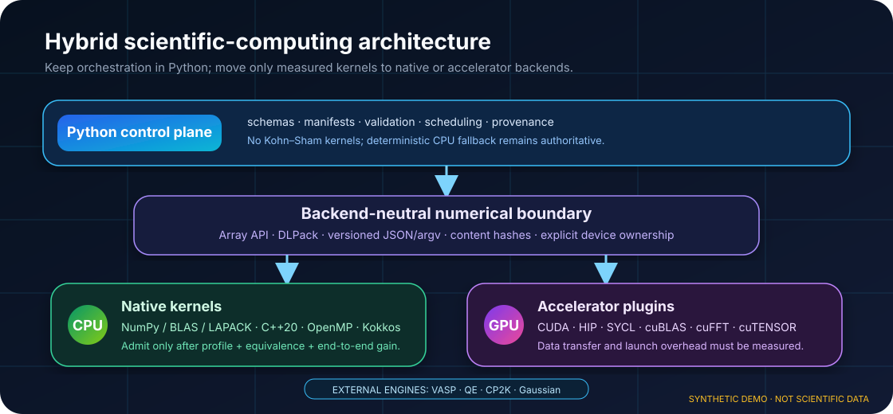
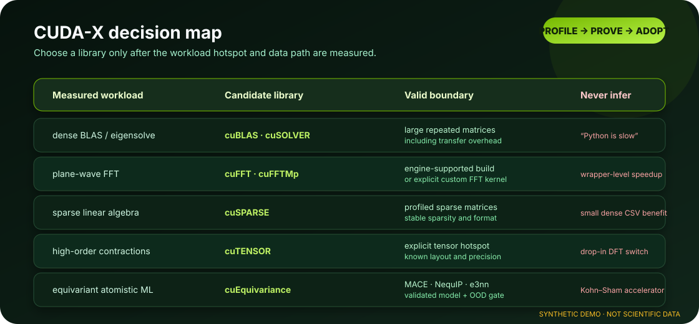
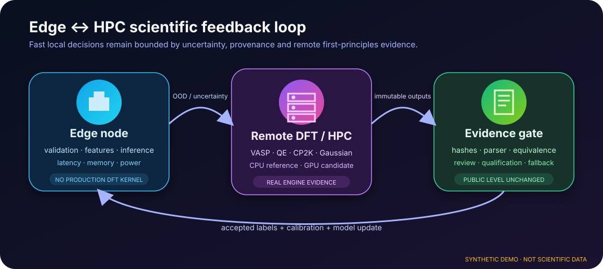
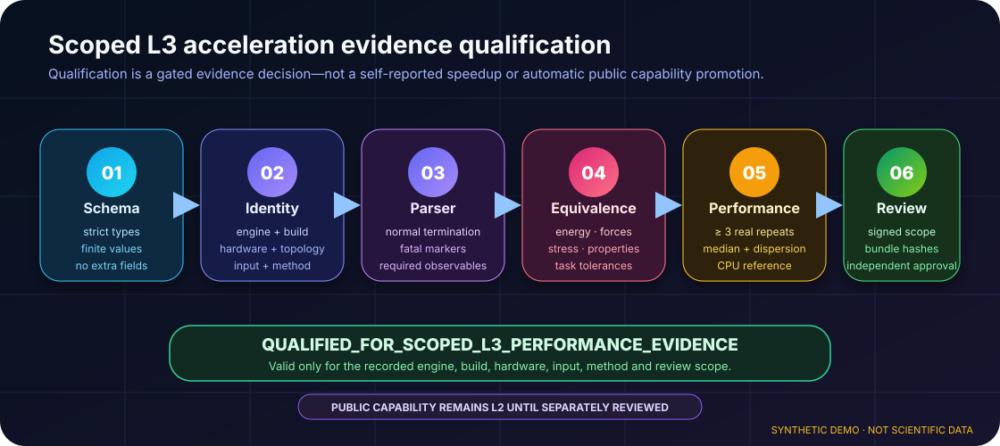

# TsaoDFT Skill

<p align="center">
  <strong>A DFT-first, evidence-locked and auditable research operating system for molecular and periodic science</strong><br>
  From structure preparation and real-engine acceptance to ML, kinetics, edge computing, GPU/HPC acceleration and traceable publication claims
</p>

<p align="center">
  <a href="README.md">中文</a> · <a href="README_EN.md">English</a>
</p>

<p align="center">
  <a href="https://github.com/SUNHAOJUN22/TsaoDFT_skill/actions/workflows/ci.yml"></a>
  
  
  
  
  
</p>

> **AI image declaration | AI-GENERATED CONCEPTUAL ILLUSTRATION:** the overview below follows an AI-assisted Hero-Centric + Evidence Bento visual direction. Molecules, lattices, orbital-like forms, servers and data interfaces communicate research context only; they are not outputs from Gaussian, VASP, Quantum ESPRESSO, CP2K, Multiwfn, VMD or experiment. The architecture gallery is made from repository-controlled deterministic SVGs. Every conceptual or synthetic asset is labelled, and quantitative claims still require accepted source files, calculation artifacts and reproducible scripts.

<p align="center">
  
</p>

## TsaoDFT in 30 seconds

<table>
<tr>
<td width="25%" valign="top"><strong>DFT-first</strong><br><sub>A question is grounded in structure, method fingerprint, reference state and acceptance criteria before execution.</sub></td>
<td width="25%" valign="top"><strong>Evidence graph</strong><br><sub>Calculations, artifacts, figures and manuscript claims receive explicit support edges; failed attempts remain visible.</sub></td>
<td width="25%" valign="top"><strong>Multi-engine</strong><br><sub>Molecular work covers Gaussian / Multiwfn / VMD; periodic work covers VASP / QE / CP2K.</sub></td>
<td width="25%" valign="top"><strong>Scale with provenance</strong><br><sub>CPU/GPU, acceleration libraries, ML, kinetics and HPC may consume accepted evidence but never bypass scientific boundaries.</sub></td>
</tr>
</table>

`TsaoDFT_skill` is not a loose prompt collection. It never promotes normal termination, attractive plots, GPU allocation or a high model score directly into a scientific conclusion:

```text
planned
→ prepared
→ completed
→ technically validated
→ scientifically accepted
→ claim accepted
```

## From scientific question to defensible claim

<p align="center">
  
</p>

Every transition must identify the acceptance owner, supporting artifact, method/version/environment and unresolved assumptions or uncertainty.

## Eight Skills, one evidence chain

| Skill | Best used for | Boundary that must not be crossed |
|---|---|---|
| [`tsao-dft-suite`](skills/tsao-dft-suite/) | DFT-first entry point, task DAG, routing, cost and approval gates | Coordinates work; does not replace engine-level scientific judgement |
| [`tsao-structure-prep`](skills/tsao-structure-prep/) | Molecules, conformers, crystals, surfaces, defects, adsorption candidates and atom mapping | Never silently chooses charge, spin, oxidation state, termination or protonation |
| [`tsao-dft-researcher`](skills/tsao-dft-researcher/) | Gaussian molecular DFT/TDDFT, Opt/Freq, TS/IRC, thermochemistry, NMR, Multiwfn and VMD | Real executables, licences and environments remain external |
| [`tsao-periodic-dft-materials`](skills/tsao-periodic-dft-materials/) | VASP, Quantum ESPRESSO and CP2K, including surfaces/defects, bands/DOS, NEB and convergence | Does not distribute POTCAR, pseudopotentials or restricted databases |
| [`tsao-dft-ml-active-learning`](skills/tsao-dft-ml-active-learning/) | DFT-label audit, leakage prevention, applicability domain, uncertainty, active learning and inverse design | High R², SHAP or acquisition score does not prove mechanism or causality |
| [`tsao-dft-kinetics-multiscale`](skills/tsao-dft-kinetics-multiscale/) | Eyring/TST, networks, detailed balance, uncertainty, microkinetics and reactor handoff | Consumes only accepted standard/reference-state evidence |
| [`tsao-dft-hpc-provenance`](skills/tsao-dft-hpc-provenance/) | Native Windows PowerShell local jobs, POSIX local jobs, Slurm/PBS, structured argv, inventory, tuning candidates, GPU planning, Parsers, real benchmarks, signed review and content-addressed evidence | GPU allocation, scheduler completion, self-reported L3 or synthetic fixtures prove neither real execution nor speedup |
| [`tsao-dft-catalysis-profile`](skills/tsao-dft-catalysis-profile/) | DCS/MCSOMe/DMOS, Si–O/Si–C, Ti/TEA, Ziegler–Natta and polyolefin catalysis | Scoped profile; never auto-applied to unrelated catalysis |

## Scientific figures: conceptual and deterministic evidence stay separate

The following figures are controlled by repository scripts and fixed synthetic data. Every asset is visibly labelled `SYNTHETIC DEMO · NOT SCIENTIFIC DATA`. They demonstrate figure contracts, evidence organisation and system design—not production results.

<table>
<tr>
<td width="50%"></td>
<td width="50%"></td>
</tr>
<tr>
<td></td>
<td></td>
</tr>
</table>

## Acceleration architecture gallery

The five deterministic SVGs below explain how the repository may consume C++, OpenMP, Kokkos, CUDA-X, edge inference and real-engine capabilities. Their visual direction is AI-assisted, but the actual assets are repository-defined, reproducible and ineligible as scientific or performance data.

<table>
<tr>
<td width="50%"></td>
<td width="50%"></td>
</tr>
<tr>
<td></td>
<td></td>
</tr>
<tr>
<td colspan="2"></td>
</tr>
</table>

See [`docs/README_VISUAL_DESIGN_SYSTEM.md`](docs/README_VISUAL_DESIGN_SYSTEM.md) and [`docs/AI_IMAGE_GOVERNANCE.md`](docs/AI_IMAGE_GOVERNANCE.md).

## Python, C++ and GPU responsibilities

The repository is Python-dominant by design, but Python is primarily the scientific control plane rather than a reimplementation of professional DFT kernels.

| Layer | Preferred technologies | Responsibility |
|---|---|---|
| Scientific control plane | Python, JSON Schema, YAML, structured argv | Workflow, preflight, fingerprints, evidence, scheduling, parsing and reporting |
| Numerical reference | NumPy, BLAS, LAPACK | Deterministic CPU reference, vectorisation, linear algebra and equivalence baseline |
| Optional native layer | C++20, OpenMP, Kokkos, narrow C ABI | Profile-proven neighbour, geometry, scanning or batched numerical hotspots |
| Optional GPU layer | CUDA, HIP, SYCL, Array API, DLPack | Large repeated kernels after transfer and launch overhead are included |
| External compute plane | VASP, QE, CP2K, Gaussian | FFT, diagonalisation, integrals, SCF and engine-native MPI/OpenMP/GPU kernels |

The rule is: **profile first; vectorise before native migration; retain the CPU reference; accept C++ or GPU backends only when numerical equivalence and end-to-end benefit both pass.**

## How CUDA-X and other acceleration libraries enter

| Library / route | Valid use | Invalid interpretation |
|---|---|---|
| cuBLAS / cuSOLVER | Large repeated dense matrices already resident on GPU | “Python code is automatically accelerated” |
| cuFFT / cuFFTMp | Supported external-engine builds or an explicit repository FFT kernel | A Python wrapper automatically accelerates VASP/QE/CP2K |
| cuSPARSE | A measured sparse-matrix hotspot | A generic optimisation for small dense tables |
| cuTENSOR | Profiled high-order contractions, permutations and reductions | A universal external-DFT switch |
| cuEquivariance | Accepted MACE, NequIP, e3nn or related equivariant models | A Kohn–Sham DFT accelerator |
| NCCL / NVSHMEM | Compatible multi-GPU communication and distributed workloads | Single-GPU, small-file or Parser optimisation |
| TensorRT / ONNX Runtime | Edge surrogate inference with UQ/OOD and remote-DFT fallback | A replacement for production DFT |

## Support levels

| Level | Meaning | Reporting boundary |
|---|---|---|
| `L0_REFERENCE` | Method and boundary reference | Method reference only |
| `L1_HANDOFF` | Structured Manifest or downstream handoff | Requires downstream validation |
| `L2_VALIDATED_ADAPTER` | Deterministic preflight/Parser/validator plus repository tests | May report adapter validation, not real-engine regression |
| `L3_EXECUTION_TESTED` | L2 plus immutable scoped real engine/build/hardware/site evidence | Real execution may be reported only within the recorded scope |

Gaussian, VASP, Quantum ESPRESSO and CP2K currently expose selected-field **L2 adapters**. The public capability remains `L2_VALIDATED_ADAPTER`. `QUALIFIED_FOR_SCOPED_L3_PERFORMANCE_EVIDENCE` is evidence eligibility only and never changes the public registry automatically.

## Quick start

```bash
python scripts/install.py --list

python scripts/install.py \
  --agent codex \
  --scope user \
  --skill all \
  --dry-run \
  --validate
```

Install all Skills:

```bash
python scripts/install.py \
  --agent codex \
  --scope user \
  --skill all
```

The installer uses ownership markers, atomic staging/replacement, rollback and a concurrent-install lock. Production execution still requires legal engines, licences, pseudopotentials/basis libraries, a site guide and authorisation.

## Native Windows local job scripts

A Windows local workflow can generate and run a PowerShell 7 script without WSL and without converting structured arguments into a command string:

```powershell
python skills/tsao-dft-hpc-provenance/scripts/generate_job_script.py `
  .\build\hpc-manifest.yaml `
  --shell powershell `
  --out .\build\job.ps1

pwsh -NoProfile -File .\build\job.ps1
```

Linux, local POSIX, Slurm and PBS keep the original backend:

```bash
python skills/tsao-dft-hpc-provenance/scripts/generate_job_script.py \
  build/hpc-manifest.yaml \
  --shell posix \
  --out build/job.sh
```

The PowerShell boundary is explicit:

- only `scheduler: local` is accepted; Slurm/PBS remain POSIX/HPC execution paths;
- `environment.modules` and `environment.source` are rejected rather than pretending Unix environment-module semantics are native Windows features;
- structured argv is passed through `.NET ProcessStartInfo.ArgumentList`, while stdout/stderr use asynchronous stream copying;
- `Invoke-Expression`, `cmd.exe` and shell-string interpolation are not used;
- approval, preflight, Parser, stdin/stdout/stderr, environment variables, scratch, exit-code precedence and runtime-evidence contracts remain active;
- Windows local execution compatibility is not Gaussian, VASP, QE, CP2K or GPU acceleration evidence.

The permanent Windows job executes real `pwsh` tests for special-character arguments, Gaussian stdin, preflight, Parser, streams and failing exit codes.

## GPU, parallel and evidence-qualification entry point

Perform non-invoking inventory, then create an acceleration plan and pending candidates:

```bash
python skills/tsao-dft-hpc-provenance/scripts/plan_acceleration.py \
  --inspect-environment --out build/acceleration-environment.json

python skills/tsao-dft-hpc-provenance/scripts/plan_acceleration.py \
  skills/tsao-dft-hpc-provenance/templates/acceleration-profile.yaml \
  --out build/acceleration-plan.json

python skills/tsao-dft-hpc-provenance/scripts/materialize_acceleration_campaign.py \
  skills/tsao-dft-hpc-provenance/templates/vasp-gpu-hpc-manifest.yaml \
  skills/tsao-dft-hpc-provenance/templates/acceleration-profile.yaml \
  --manifest-out build/vasp-h100.yaml \
  --matrix-out build/benchmark-matrix.csv \
  --candidate-dir build/candidates \
  --plan-out build/acceleration-plan.json
```

Every candidate remains `approval: pending`; no job is submitted. Formal executable, launcher, preflight and Parser commands use structured argv. Approval is bound to the Manifest digest, plan, candidate and method fingerprint.

### Validate one real benchmark result

The root benchmark Schema and scoped-L3 policy are part of the permanent quality gate. A result can be validated independently:

```bash
python scripts/validate_acceleration_contracts.py \
  --result build/benchmark-result.json \
  --json
```

The gate rejects zero wall time, NaN/Inf, boolean integers, non-lowercase SHA-256 values, unknown fields, invalid timestamps and accepted real runs without complete build, hardware and scientific-result identity.

### Import, qualify and verify an evidence bundle

```bash
python skills/tsao-dft-hpc-provenance/scripts/import_benchmark_evidence.py \
  results/* \
  --schema skills/tsao-dft-hpc-provenance/templates/benchmark-result.schema.json \
  --artifact-root run-artifacts \
  --out build/evidence.jsonl

python skills/tsao-dft-hpc-provenance/scripts/qualify_performance_evidence.py \
  results/* \
  --result-schema skills/tsao-dft-hpc-provenance/templates/benchmark-result.schema.json \
  --policy skills/tsao-dft-hpc-provenance/templates/performance-qualification-policy.yaml \
  --policy-schema skills/tsao-dft-hpc-provenance/templates/performance-qualification-policy.schema.json \
  --artifact-root run-artifacts \
  --review signed-review-attestation.json \
  --review-public-key reviewer-ed25519-public.pem \
  --out-parent build/performance-evidence

python skills/tsao-dft-hpc-provenance/scripts/verify_evidence_bundle.py \
  build/performance-evidence/evidence-<root_sha256>
```

Formal comparison accepts one benchmark plan. Schema, input, method, build, hardware, topology, Parser and numerical equivalence must pass before effective speedup is calculated. The review must be Ed25519-signed and bind the Policy, plan, candidates and evidence root; publication is atomic.

## Engineering quality and one-command acceptance

```bash
python -m pip install -c constraints/py312.txt -r requirements-dev.txt
python -m pip check
python scripts/quality_gate.py
```

Current Linux code-qualification baseline: **539 tests, 9 isolated suites, 0 failed suites; 94.38% statement and 84.41% branch coverage.**

The permanent Windows job runs the same **539 tests** and measures **94.32% statement / 84.22% branch coverage**. `generate_job_script.py` remains at **100% statement / 100% branch coverage** on Linux and Windows.

The permanent gate covers 9 isolated test suites, Python 3.10 / 3.12 / 3.13, Windows PowerShell, statement and branch coverage, 18 mypy targets, 4 strict trust-boundary type targets, Ruff, Bandit, repository audit, CodeQL, three `pip-audit` modes and CycloneDX JSON SBOM. Supply-chain reports and the SBOM are preserved before a failing audit makes the workflow fail.

```text
assets and executable contracts
→ dependency and constraint validation
→ acceleration evidence schema/policy validation
→ governance, capability and security validators
→ Ruff lint and formatting
→ isolated mypy + strict trust-boundary mypy
→ Linux and Windows statement/branch coverage
→ Bandit + strict repository audit
→ all isolated unittest suites + real pwsh execution
→ pip-audit + SBOM + CodeQL
```

- [`docs/REPOSITORY_FULL_AUDIT.md`](docs/REPOSITORY_FULL_AUDIT.md)
- [`docs/CODE_QUALITY_AUDIT.md`](docs/CODE_QUALITY_AUDIT.md)
- [`docs/TEST_REPORT.md`](docs/TEST_REPORT.md)
- [`docs/PERFORMANCE_GUIDE.md`](docs/PERFORMANCE_GUIDE.md)
- [`docs/SCIENTIFIC_CLAIM_POLICY.yaml`](docs/SCIENTIFIC_CLAIM_POLICY.yaml)

## Scientific boundaries

This repository:

- does not distribute or bypass restricted engines, licences, POTCAR, pseudopotentials or basis/potential libraries;
- never presents conceptual AI imagery or synthetic SVGs as computational or experimental evidence;
- never equates normal termination, scheduling, model scores, attractive graphics, GPU allocation or hosted fixtures with scientific acceptance;
- does not accept a plain `approved` field as signed approval;
- does not claim `L3_EXECUTION_TESTED` without legal real-engine/build/hardware/site repeats, a verified content-addressed evidence root, signed independent review and explicit registration.

## Documentation map

| Document | Purpose |
|---|---|
| [`docs/ARCHITECTURE.md`](docs/ARCHITECTURE.md) | Architecture and state flow |
| [`docs/ENGINE_SUPPORT_MATRIX.md`](docs/ENGINE_SUPPORT_MATRIX.md) | Engine coverage and support levels |
| [`docs/CAPABILITY_STATUS.yaml`](docs/CAPABILITY_STATUS.yaml) | Machine-readable capability status |
| [`docs/SCIENTIFIC_BOUNDARIES.md`](docs/SCIENTIFIC_BOUNDARIES.md) | Scientific boundaries and non-claims |
| [`docs/SCIENTIFIC_CLAIM_POLICY.yaml`](docs/SCIENTIFIC_CLAIM_POLICY.yaml) | Generic and acceleration L3 evidence contracts |
| [`docs/CROSS_SKILL_HANDOFF.md`](docs/CROSS_SKILL_HANDOFF.md) | Cross-Skill handoff contract |
| [`docs/REPOSITORY_FULL_AUDIT.md`](docs/REPOSITORY_FULL_AUDIT.md) | Full repository audit |
| [`docs/CODE_QUALITY_AUDIT.md`](docs/CODE_QUALITY_AUDIT.md) | Code, test, coverage and CI audit |
| [`docs/SUPPLY_CHAIN_POLICY.md`](docs/SUPPLY_CHAIN_POLICY.md) | Dependency, vulnerability, SBOM and release policy |
| [`docs/AI_IMAGE_GOVERNANCE.md`](docs/AI_IMAGE_GOVERNANCE.md) | AI-image and deterministic-demo governance |
| [`docs/PERFORMANCE_GUIDE.md`](docs/PERFORMANCE_GUIDE.md) | Execution, acceleration and signed-evidence boundary |
| [`docs/TEST_REPORT.md`](docs/TEST_REPORT.md) | Test and engineering acceptance |

Repository policy: **work directly on `main`; do not create feature, fix or temporary branches. Use Tags / Releases for publication snapshots.**